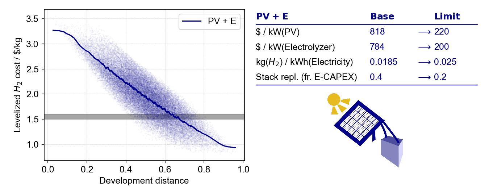

===============
Getting started
===============

.. contents:: Table of Contents
    :depth: 2
    :local:
    :class: this-will-duplicate-information-and-it-is-still-useful-here

Installation
============

pyH2A can be installed using ``pip``:

.. code-block:: bash

	pip install pyH2A

Choose configuration
====================

First, the configuration of the hydrogen production technology should be specified. This is done by selecting the appropiate plugins, which together form the desired production pathway. For example, in case of photovoltaic + electrolysis (PV+E), the :class:`~pyH2A.Plugins.Hourly_Irradiation_Plugin` and :class:`~pyH2A.Plugins.Photovoltaic_Plugin` may be used: `Hourly_Irradiation_Plugin` models the irradiation in specified location, while `Photovoltaic_Plugin` models electricity production using PV based on the hourly irradiation data and subsequent production of hydrogen from electrolysis. Changing the plugins changes the technology configuration and new configurations (e.g. including battery storage) can be modelled by creating new plugins (see :ref:`plugin_guide_label` for information on how to create new plugins).

The chosen plugins are specified in the `Workflow` table of the input file:

.. code-block:: markdown

	# Workflow

	Name | Type | Position
	--- | --- | ---
	Hourly_Irradiation_Plugin | plugin | 0
	Photovoltaic_Plugin | plugin | 0

``Name`` is the name of the used module, ``Type`` is the type of module (in both cases ``plugin``) and ``Posiition`` refers to the the position in the workflow when this module is executed (in this case both positions are 0, meaning that these plugins are executed at the beginning of the workflow with ``Hourly_Irradiation_Plugin`` being executed before ``Photovoltaic`` plugin). See :ref:`default_settings_label` for the default positions of the different elements of the workflow. 

At this point one may also specify the analysis modules which are to be used. These are included by putting a header with the name of the analysis module into the input file.

.. code-block:: markdown

	# Monte_Carlo_Analysis

This header request the :class:`~pyH2A.Analysis.Monte_Carlo_Analysis` module.

Generate input file template
============================

The input file containing the ``Workflow`` tabe and possible analysis headings is the starting point to generate the full input file template.

At this point the input file may look like this:

.. code-block:: markdown

	# Workflow

	Name | Type | Position
	--- | --- | ---
	Hourly_Irradiation_Plugin | plugin | 0
	Photovoltaic_Plugin | plugin | 0

	# Monte_Carlo_Analysis

In the current directory, the ``generate`` function from the pyH2A command line interface may be used to generate the full input file template:

.. code-block:: bash

	pyH2A generate -i input.md -o input_full.md --origin --comments

The ``--origin`` flag includes information in the template on which plugin/module has requested a given input. The ``--comments`` flag includes additional information on the requested input (from the documentation). The flags can be omitted to obtain a cleaner input file template.

The thus generated file ``input_full.md`` can be used to enter the model information. 

Enter model information
=======================

The input file template specifies which model information has to be entered for the selected technology configuration. For example, ``Hourly_Irradiation_Plugin`` requests a file containg hourly irradiation data:

.. code-block:: markdown

	# Hourly Irradiation

	Parameter | Value | Comment Value
	--- | --- | ---
	File | str | Path to a `.csv` file containing hourly irradiance data as provided by https://re.jrc.ec.europa.eu/pvg_tools/en/#TMY, ``process_table()`` is used.

``str`` indicates that a string which a path to the file is requested (regular Python types are used for input prompts, such as ``str``, ``int``, ``float``, ``ndarray`` etc.).

Other tables allow for flexible processing of input information, which is indicated by the placeholder ``[...]``. For example, the default ``Capital_Cost_Plugin`` creates this input prompt:

.. code-block:: markdown

	# [...] Direct Capital Cost [...]

	Parameter | Value | Comment Value
	--- | --- | ---
	[...] | float | ``sum_all_tables()`` is used.

The leading and ending ``[...]`` indicates a table group, meaning that all tables containing the center string in their heading will be processed together (in case of ``Direct Capital Cost`` this can for example be used to break up the information on direct capital costs into seperate tables for easier readability and subsequent cost breakdown analysis).

The ``[...]`` in the ``Parameter`` column indidcates that any parameter name can be chosen here and any number of parameters can be entered into the table. :func:`~pyH2A.Utilities.input_modification.sum_all_tables` means that all the information will ultimately be summed up to compute the total capital cost.

Instead of entering actual values, it is also possible to enter references to other parts of the input file, using the ``table > row > column`` synthax. This kind of reference can either be entered directly into the prompted input field (for example entering it in the ``Value`` column of ``Direct Capital Cost`` table), or ``Path`` column can be added. For example:

.. code-block:: markdown

	# Electrolyzer

	Name | Value
	--- | ---
	Nominal Power (kW) | 5,500.0
	...

	# Photovoltaic

	Name | Value | Path
	--- | --- | ---
	Nominal Power (kW) | 1.5 | Electrolyzer > Nominal Power (kW) > Value 
	...

In this case, the ``Path`` column of ``Photovoltaic > Nominal Power (kW) > Value`` references ``Electrolyzer > Nominal Power (kW) > Value``. Because the reference is in the ``Path`` column, the referenced value is multiplied by the value in ``Photovoltaic > Nominal Power (kW) > Value``. In this case, use of referencing ensures that the photovoltaic nominal power is a factor of 1.5 higher than the electrolyzer nominal power (and it is automatically updated when the electrolyzer nominal power is changed).

Run pyH2A
=========

Once all the model information has been entered, pyH2A can be run to perform the actual techno-economic analysis. This can be done using the command line interface:

.. code-block:: bash

	pyH2A run -i input_full.md -o .

``-i`` specifies the path of the input file (in this example the input file is in the current directory) and ``-o`` specifies the output directory (``.`` means the current directory is selected for the output).

Upon completion, pyH2A prints the levelized cost of hydrogen, for example:

.. code-block:: markdown

	Levelized cost of hydrogen (base case): 3.5777931317137512 $/kg

Generate plots, save results, access information
================================================

The power of pyH2A lies in the ability to interface the core techno-economic analysis with different analysis modules to perform in-depth analysis of the results. For example, when the ``Monte_Carlo_Analysis`` module is requested in the input file, Monte Carlo analysis is performed in which selected input parameters are randomly varied to analyze the future hydrogen cost trajectory. Typically, analysis modules contain methods to generate plots of the analysis results. These are requested by adding a ``Methods`` table to the input file. For example:

.. code-block:: markdown

	# Methods - Monte_Carlo_Analysis

	Name | Method Name | Arguments
	--- | --- | ---
	distance_cost_relationship | plot_distance_cost_relationship | Arguments - MC Analysis - distance_cost

Including this table in the input file requests that the :func:`~pyH2A.Analysis.Monte_Carlo_Analysis.Monte_Carlo_Analysis.plot_distance_cost_relationship` method is executed. Arguments can be passed to the method in the ``Arguments`` column. In this case, a simple string is included ``Arguments - MC Analysis - distance_cost``. This directs pyH2A to another table in the input file which contains the method arguments:

.. code-block:: markdown
	
	# Arguments - MC Analysis - distance_cost

	Name | Value
	--- | ---
	show | True
	save | False
	legend_loc | upper right
	log_scale | False
	plot_kwargs | {'dpi': 300, 'left': 0.09, 'right': 0.5, 'bottom': 0.15, 'top': 0.95, 'fig_width': 9, 'fig_height': 3.5}
	table_kwargs | {'ypos': 0.5, 'xpos': 1.05, 'height': 0.5}
	image_kwargs | {'path': 'pyH2A.Other~PV_E_Clipart.png', 'x': 1.6, 'zoom': 0.095, 'y': 0.2}

This synthax is useful when a number of arguments are provided. Alternatively, a dictionary which arguments can be directly included in the ``Arguments`` column:

.. code-block:: markdown

	# Methods - Monte_Carlo_Analysis

	Name | Method Name | Arguments
	--- | --- | ---
	distance_cost_relationship | plot_distance_cost_relationship | {'show': True, 'save': True}

By setting ``save`` to ``True``, the plot is saved to the output directory. In this case, the following plot is generated:

   Example output plot from Monte Carlo analysis.

To access detailed information, which is generated during runtime, pyH2A can also be run from a Python script, which allows for full access to the information. For example:

.. code-block:: Python

	from pyH2A.run_pyH2A import pyH2A

	result = pyH2A('input_full.md', '.')

``result`` is a pyH2A class object. Its attributes contain all the information from the pyH2A run. For example, ``result.inp`` is a dictionary with all processed input information, ``result.base_case`` contains the information from the discounted cashflow calculation for the specified input information (base case), including all information generated by plugins (accessible via ``result.base_case.plugs``, which is dictionary with all plugin class instances). Furthermore, ``result.meta_modules`` is a dictionary which contains all of the analysis module class instances, which were generated during the pyH2A run. With this methodology, pyH2A calculations and results can be integrated into other scripts/programs.

